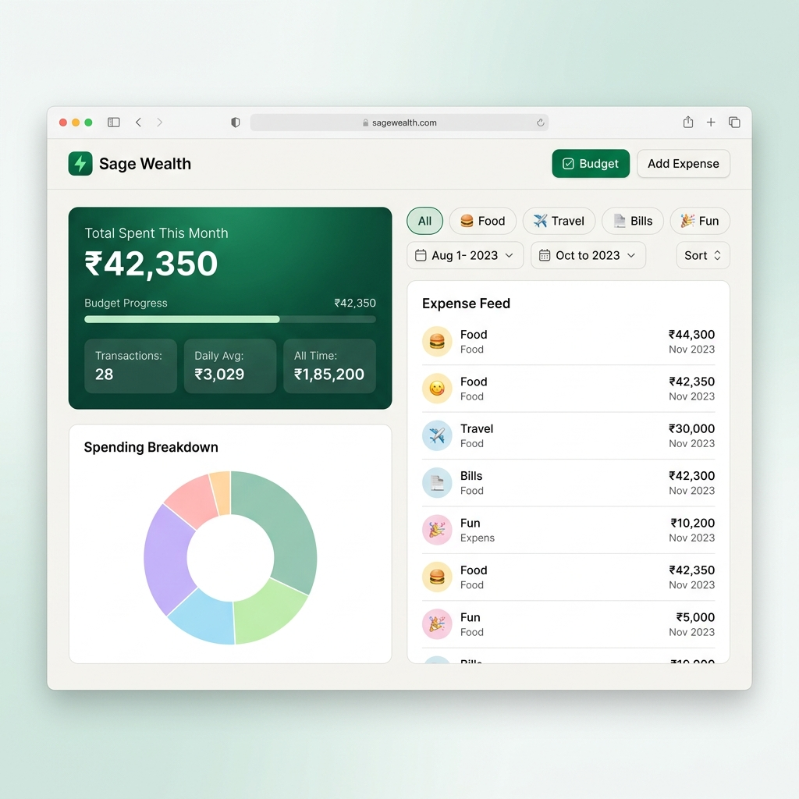
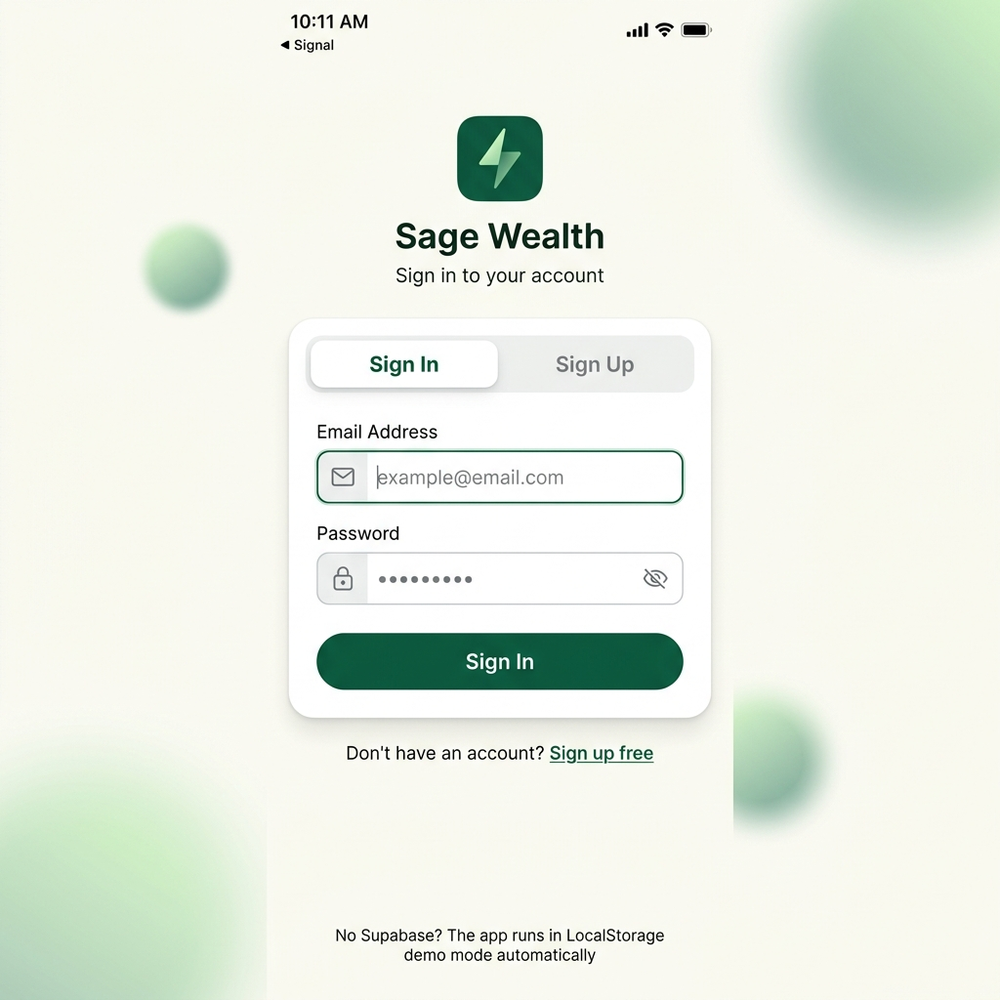
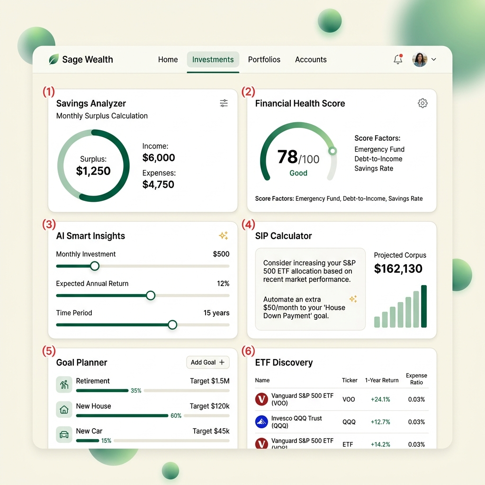
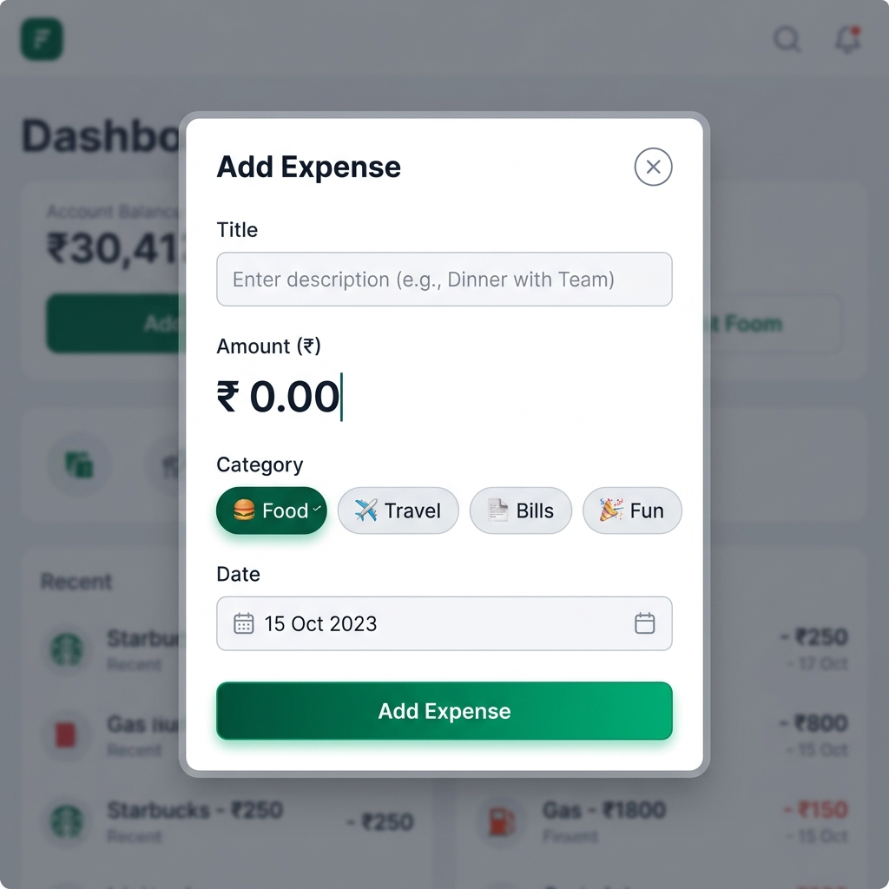
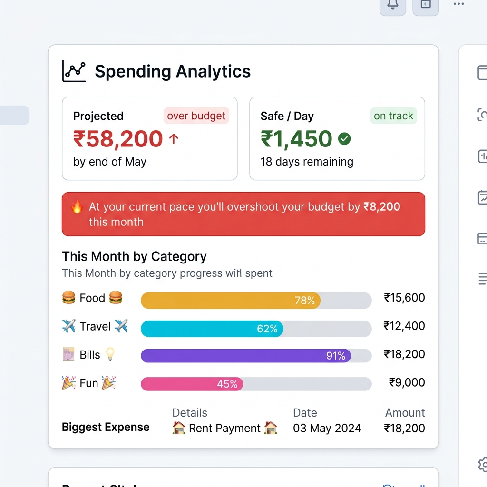

<](https://react.dev/)
[](https://www.typescriptlang.org/)
[](https://vitejs.dev/)
[](https://supabase.com/)
[](https://www.chartjs.org/)

**A calm, sophisticated personal finance dashboard** built with React + TypeScript.  
Works instantly in **demo mode** (LocalStorage) — or connect Supabase for cloud sync & authentication.

</div>

---

## 📸 Screenshots

### Dashboard — Expenses Overview



> The main dashboard shows your monthly spending at a glance — balance card with budget progress, spending breakdown chart, category filters, and a real-time expense feed.

---

### Authentication Page



> Clean sign-in / sign-up flow powered by Supabase Auth. Falls back to LocalStorage demo mode when Supabase is not configured.

---

### Investments Hub



> Full-featured investment section with Savings Analyzer, Financial Health Score, SIP Calculator, Goal Planner, ETF Discovery, and educational Learn Cards.

---

### Add Expense Modal



> Quick-add expenses with title, amount, category selection (🍔 Food, ✈️ Travel, 📑 Bills, 🎉 Fun), and date picker.

---

### Spending Analytics



> Smart analytics card showing projected month-end spend, safe daily budget, category breakdown with progress bars, and biggest expense tracking.

---

## ✨ Features

### 💰 Expense Tracking
- **Add / Delete expenses** with title, amount, category & date
- **4 categories**: 🍔 Food · ✈️ Travel · 📑 Bills · 🎉 Fun
- **Real-time totals** — monthly spend, daily average, all-time total
- **Optimistic UI** — changes appear instantly, sync in background

### 📊 Budget Management
- **Set monthly budget** via the Budget modal
- **Visual progress bar** — green → amber → red as you approach your limit
- **Over-limit protection** — confirmation modal when adding an expense that exceeds your budget
- **Budget warnings** at 80% and 100% thresholds

### 📈 Smart Analytics
- **Projected month-end spend** based on your daily average
- **Safe-to-spend per day** — how much you can spend daily to stay on budget
- **Category breakdown** with percentage bars
- **Biggest expense** of the month highlighted

### 🔍 Powerful Filtering & Sorting
- **Category filter tabs** — view all or filter by Food / Travel / Bills / Fun
- **Date range filter** — pick custom from/to dates
- **Sort options** — Newest First, Oldest First, Highest Amount, Lowest Amount

### 💼 Investment Tools
- **Savings Analyzer** — monthly surplus calculation
- **Financial Health Score** — animated gauge (0–100)
- **AI-Powered Insights** — smart recommendations based on spending
- **SIP Calculator** — project future corpus with compound interest
- **Goal Planner** — plan for retirement, house, car, education
- **ETF Discovery** — browse popular index funds
- **Learn Cards** — financial literacy tips and guides

### 🔐 Authentication & Cloud Sync
- **Supabase Auth** — email/password sign-up & sign-in
- **Row Level Security** — every user sees only their own data
- **Dual-mode architecture** — works offline with LocalStorage, syncs with Supabase when configured
- **Demo data seeder** — auto-populates realistic sample data on first load

### 🎨 Design & UX
- **Premium Forest Green** color palette (#065F46 + #6EE7B7)
- **Inter font** with tabular numerals for aligned numbers
- **Glassmorphic header** with blur backdrop
- **Skeleton loaders** — shimmer animation while data loads
- **Responsive layout** — desktop two-column grid, mobile single-column
- **Floating Action Button** (FAB) on mobile for quick expense entry

---

## 🛠️ Tech Stack

| Layer | Technology | Purpose |
|-------|-----------|---------|
| **Frontend** | React 19 + TypeScript 6 | Component-based UI with type safety |
| **Build Tool** | Vite 8 | Lightning-fast HMR & bundling |
| **Styling** | Vanilla CSS + CSS Variables | Custom design system, no framework lock-in |
| **Charts** | Chart.js 4 + react-chartjs-2 | Doughnut spending breakdown chart |
| **Icons** | Lucide React | Consistent, lightweight icon set |
| **Backend** | Supabase (PostgreSQL) | Database, Auth, Row Level Security |
| **Fallback** | LocalStorage API | Offline-first demo mode |

---

## 🚀 Getting Started

### Prerequisites

- **Node.js** ≥ 18.x
- **npm** ≥ 9.x (comes with Node.js)
- **Supabase account** _(optional — for cloud mode)_

### 1. Clone the Repository

```bash
git clone https://github.com/your-username/sage-wealth.git
cd sage-wealth
```

### 2. Install Dependencies

```bash
npm install
```

### 3. Start the Development Server

```bash
npm run dev
```

The app will open at **http://localhost:5173/**

> 🎉 **That's it!** The app runs immediately in **Demo Mode** using LocalStorage.  
> You'll see a purple banner: _"Demo mode — running on LocalStorage."_  
> Sample expenses are auto-seeded so the dashboard looks populated from the start.

---

## ☁️ Setting Up Supabase (Cloud Mode)

To enable user accounts, cloud sync, and multi-device access:

### Step 1 — Create a Supabase Project

1. Go to [supabase.com](https://supabase.com) and create a free account
2. Click **New Project** and choose a name & password
3. Wait for the project to provision (~2 minutes)

### Step 2 — Get Your API Keys

1. In the Supabase Dashboard, go to **Project Settings → API**
2. Copy the following values:
   - **Project URL** — looks like `https://abcdefgh.supabase.co`
   - **Anon Public Key** — a long `eyJ...` JWT string

### Step 3 — Configure the App

Open `src/lib/supabaseClient.ts` and replace the placeholder values:

```typescript
// ── Replace these two lines with your real values ──
const SUPABASE_URL  = 'https://YOUR_PROJECT_REF.supabase.co';
const SUPABASE_ANON = 'YOUR_ANON_PUBLIC_KEY';
```

### Step 4 — Create the Database Schema

1. In Supabase Dashboard, go to **SQL Editor**
2. Click **New Query**
3. Copy and paste the entire contents of `supabase/schema.sql`
4. Click **Run** ▶

This creates:
- ✅ `expenses` table with UUID primary key
- ✅ Indexes for fast queries (user_id, date, category)
- ✅ Row Level Security policies (users see only their own data)
- ✅ `get_category_totals()` RPC function
- ✅ `get_monthly_summary()` RPC function

### Step 5 — Restart & Test

```bash
npm run dev
```

You should now see the **Sign In / Sign Up** page instead of the demo banner.

---

## 📖 How to Use — Step by Step

### 🟢 Step 1: Open the App

Launch the app at `http://localhost:5173/`. In demo mode, you'll land directly on the dashboard with pre-seeded sample data.

If Supabase is configured, you'll see the **authentication page** — sign up with email & password, then sign in.

---

### 🟢 Step 2: Explore the Dashboard

The main **Expenses** tab has two panels:

**Left Panel:**
- **Balance Card** — Shows total spent this month, budget progress bar, and three mini stats (Transactions, Daily Avg, All Time)
- **Spending Breakdown** — Doughnut chart showing how your money is split across categories
- **Spending Analytics** — Projected month-end spend, safe daily allowance, category bars, and biggest expense

**Right Panel:**
- **Category Tabs** — Click to filter expenses by category (All / 🍔 Food / ✈️ Travel / 📑 Bills / 🎉 Fun)
- **Controls Bar** — Toggle date filter, choose sort order (Newest, Oldest, Highest, Lowest)
- **Expense Feed** — Scrollable list of all your expenses with swipe-to-delete

---

### 🟢 Step 3: Add an Expense

1. Click the green **"+ Add Expense"** button in the header (or the floating ➕ button on mobile)
2. Fill in the modal form:
   - **Title** — What you spent on (e.g., "Lunch at Dominos")
   - **Amount** — How much in ₹ (e.g., 450)
   - **Category** — Pick one: Food, Travel, Bills, or Fun
   - **Date** — Defaults to today; change if backdating
3. Click **"Add Expense"**
4. The expense appears instantly in the feed and all charts update

> ⚠️ **Budget Protection:** If the expense would exceed your monthly budget, an **Over Limit Modal** appears asking you to confirm or cancel.

---

### 🟢 Step 4: Set Your Monthly Budget

1. Click the **"🎯 Budget"** button in the header
2. Enter your monthly spending limit (e.g., ₹50,000)
3. Click **Save**

Now you'll see:
- A **progress bar** on the balance card (green → amber at 80% → red when exceeded)
- A **warning banner** when you hit 80% or exceed your budget
- **Safe-to-spend per day** in the analytics card

---

### 🟢 Step 5: Filter & Sort Expenses

**By Category:**
- Click the category pills (All, 🍔 Food, ✈️ Travel, 📑 Bills, 🎉 Fun)
- The expense feed and chart update instantly

**By Date Range:**
- Click **"📅 Date Filter"** to expand the date picker
- Set **From** and **To** dates to narrow results
- Click **"Clear dates ✕"** to reset

**By Sort Order:**
- Use the dropdown: Newest First, Oldest First, Highest Amount, Lowest Amount

---

### 🟢 Step 6: Delete an Expense

- In the **Expense Feed**, hover over any expense row
- Click the **🗑️ delete** button
- The expense is removed instantly (with undo on failure)

---

### 🟢 Step 7: Explore Investments

Click the **"📈 Investments"** tab in the navigation bar to access:

| Section | What It Does |
|---------|-------------|
| **Savings Analyzer** | Calculates your monthly surplus (budget − spent) and projects yearly savings |
| **Health Score** | Animated 0–100 gauge rating your financial discipline |
| **AI Insights** | Smart cards with personalized tips based on your spending patterns |
| **SIP Calculator** | Input monthly SIP, return rate & years → see projected corpus with compound interest |
| **Goal Planner** | Set financial goals (retirement, house, car) and see required monthly savings |
| **ETF Discovery** | Browse popular index funds and ETFs with return data |
| **Learn Cards** | Bite-sized financial literacy tips to improve money management |

---

## 📂 Project Structure

```
sage-wealth/
├── index.html                  # Entry HTML — loads fonts, meta tags
├── package.json                # Dependencies & scripts
├── vite.config.ts              # Vite + React plugin config
├── tsconfig.json               # TypeScript configuration
│
├── public/                     # Static assets (favicon, etc.)
│
├── supabase/
│   └── schema.sql              # Full database schema (run in SQL Editor)
│
├── src/
│   ├── main.tsx                # React DOM root mount
│   ├── Root.tsx                # Auth state listener — gates App vs AuthPage
│   ├── App.tsx                 # Main dashboard (expenses page + investments page)
│   ├── types.ts                # Expense, Budget, Category types & config
│   ├── utils.ts                # Helpers: fmt(), loadBudget(), saveBudget()
│   ├── index.css               # Complete design system (CSS variables, components)
│   │
│   ├── lib/
│   │   ├── supabaseClient.ts   # Supabase client init + IS_CONFIGURED flag
│   │   ├── expenseApi.ts       # CRUD API (dual-mode: Supabase ↔ LocalStorage)
│   │   └── demoSeed.ts         # Auto-seeds realistic demo data on first load
│   │
│   └── components/
│       ├── AuthPage.tsx        # Sign In / Sign Up form (Supabase Auth)
│       ├── AddExpenseModal.tsx  # Modal for adding new expenses
│       ├── BudgetModal.tsx     # Modal for setting monthly budget
│       ├── OverLimitModal.tsx   # Confirmation when exceeding budget
│       ├── ExpenseList.tsx     # Scrollable expense feed
│       ├── CategoryChart.tsx   # Doughnut spending breakdown (Chart.js)
│       ├── AnalyticsCard.tsx   # Projected spend, safe/day, category bars
│       ├── InvestmentsPage.tsx # Investment tab container
│       │
│       └── investments/
│           ├── SavingsAnalyzer.tsx  # Monthly surplus + yearly projection
│           ├── HealthScore.tsx      # Financial health gauge (0–100)
│           ├── AICards.tsx          # Smart recommendation cards
│           ├── SIPSection.tsx       # SIP compound interest calculator
│           ├── GoalPlanner.tsx      # Financial goal tracker
│           ├── ETFSection.tsx       # ETF/index fund discovery
│           └── LearnCards.tsx       # Financial literacy tips
│
└── docs/
    └── screenshots/            # README images
```

---

## 🏗️ Architecture

```
┌─────────────────────────────────────────────────────┐
│                    Root.tsx                          │
│          (Auth state listener via Supabase)          │
│                                                     │
│   ┌─────────────┐        ┌────────────────────┐     │
│   │  AuthPage   │   OR   │      App.tsx       │     │
│   │ (Sign In/Up)│        │  (Main Dashboard)  │     │
│   └─────────────┘        └────────┬───────────┘     │
│                                   │                 │
│                    ┌──────────────┼──────────────┐   │
│                    ▼              ▼              ▼   │
│              Expenses Tab   Investments Tab   Modals │
│              ┌──────────┐  ┌─────────────┐  ┌─────┐ │
│              │BalanceCard│  │SavingsAnalyz│  │Add  │ │
│              │SpendChart │  │HealthScore  │  │Budgt│ │
│              │Analytics  │  │SIPCalc      │  │Over │ │
│              │ExpenseFeed│  │GoalPlanner  │  │Limit│ │
│              │Filters    │  │ETF/Learn    │  │     │ │
│              └────┬──────┘  └─────────────┘  └─────┘ │
│                   │                                  │
│                   ▼                                  │
│         ┌─────────────────┐                          │
│         │  expenseApi.ts  │  ← Dual-mode API layer   │
│         └────┬───────┬────┘                          │
│              │       │                               │
│      ┌───────▼──┐ ┌──▼────────┐                      │
│      │Supabase  │ │LocalStorage│                     │
│      │(Cloud DB)│ │(Demo Mode) │                     │
│      └──────────┘ └───────────┘                      │
└─────────────────────────────────────────────────────┘
```

---

## 🧩 Available Scripts

| Command | Description |
|---------|-------------|
| `npm run dev` | Start Vite dev server with hot reload |
| `npm run build` | Type-check with `tsc` + production build |
| `npm run preview` | Preview production build locally |

---

## 🌐 Deployment

### Netlify (Recommended)

1. Push your code to GitHub
2. Connect the repo on [netlify.com](https://netlify.com)
3. Build settings:
   - **Build command:** `npm run build`
   - **Publish directory:** `dist`
4. Deploy! 🚀

### Vercel

1. Import your repo on [vercel.com](https://vercel.com)
2. Vite is auto-detected — just click **Deploy**

### Manual

```bash
npm run build
# Upload the `dist/` folder to any static hosting
```

---

## 🔧 Environment & Configuration

| Config | Location | Purpose |
|--------|----------|---------|
| Supabase URL | `src/lib/supabaseClient.ts` | Your project's API endpoint |
| Supabase Anon Key | `src/lib/supabaseClient.ts` | Public client key for RLS |
| Database Schema | `supabase/schema.sql` | Run once in Supabase SQL Editor |
| Budget | Stored in `localStorage` | Per-device user preference |

> **Security Note:** The anon key is safe to expose in client code — Supabase RLS policies ensure users can only access their own data. Never expose the **service_role** key.

---

## 🤝 Contributing

1. **Fork** the repository
2. **Create** a feature branch: `git checkout -b feature/amazing-feature`
3. **Commit** your changes: `git commit -m 'Add amazing feature'`
4. **Push** to the branch: `git push origin feature/amazing-feature`
5. **Open** a Pull Request

---

## 📄 License

This project is open source and available under the [MIT License](LICENSE).

---

<div align="center">

**Built with 💚 using React, TypeScript, Vite & Supabase**

_Sage Wealth — Your calm, sophisticated financial companion._

</div>
]]>
